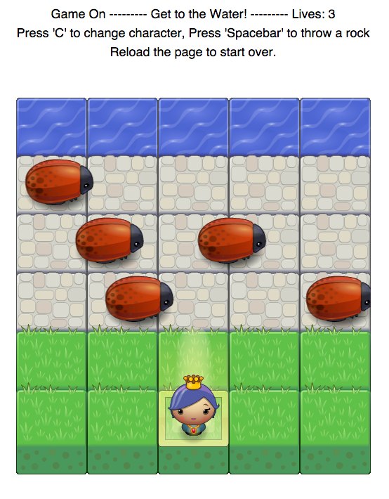

frontend-nanodegree-arcade-game
===============================

This is my version of a frogger-like arcade game for project 3 of the [Udacity Front-End Web Developer Nanodegree]
(https://www.udacity.com/course/nd001).

This project provided experience with object-oriented Javascript and the HTML5 Canvas.

**Associated Udacity courses include:**

* [Object-Oriented Javascript](https://www.udacity.com/course/ud015)
* [HTML5 Canvas](https://www.udacity.com/course/ud292)

**Goal of the Project:**

* The game runs error free (player cannot move off screen, enemies cross the screen, enemy-player collision resets the game).
* Game objects (player and enemies) are implemented using Javascript's object-oriented programming features.
* Code is formatted with consistent, logical, and easy-to-read formatting.

**Bonus:**

* Additional functionality added to the game beyond minimum requirements.

###Playing the Game:

The object of the game is to avoid the enemy bugs and successfully
make it to the water.

To play the game, clone it from my github account:

```
git clone https://github.com/benplant/frontend-nanodegree-arcade-game.git
```

and then open index.html in your browser.

**Controls:**

* Move up: up arrow key<br>
* Move down: down arrow key<br>
* Move left: left arrow key<br>
* Move right: right arrow key<br>
* Change character: C key<br>
* Throw a rock: Spacebar<br>

Enjoy!

**Results:**

An error free game with all the basic requirements, plus a few extras (character changes, rock throwing, scoreboard)




###Resources Used:

**Primary Courses**

* [Object-Oriented Javascript](https://www.udacity.com/course/ud015)
* [HTML5 Canvas](https://www.udacity.com/course/ud292)

**Additional Resources**

* [Udacity Style Guide](http://udacity.github.io/frontend-nanodegree-styleguide/javascript.html)
* Piazza Forums and Google+ Office Hours
* Books: Eloquent Javascript, Javascript: The Good Parts, Javascript & JQuery by Jon Duckett
* [Mozilla article on 2D Collision detection](https://developer.mozilla.org/en-US/docs/Games/Techniques/2D_collision_detection)

